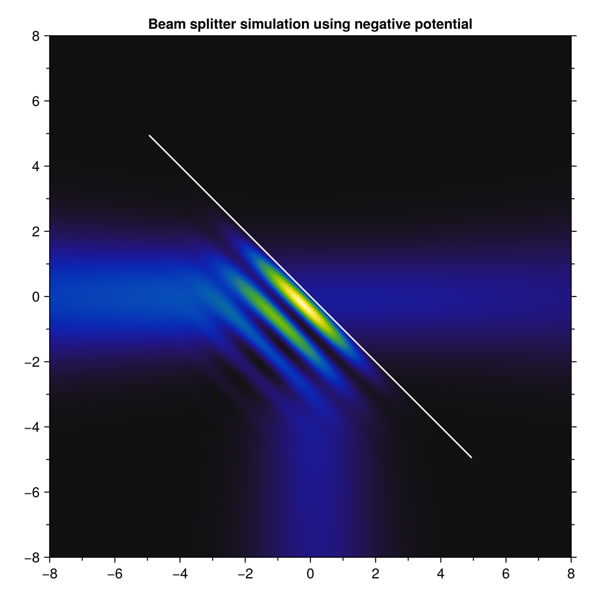
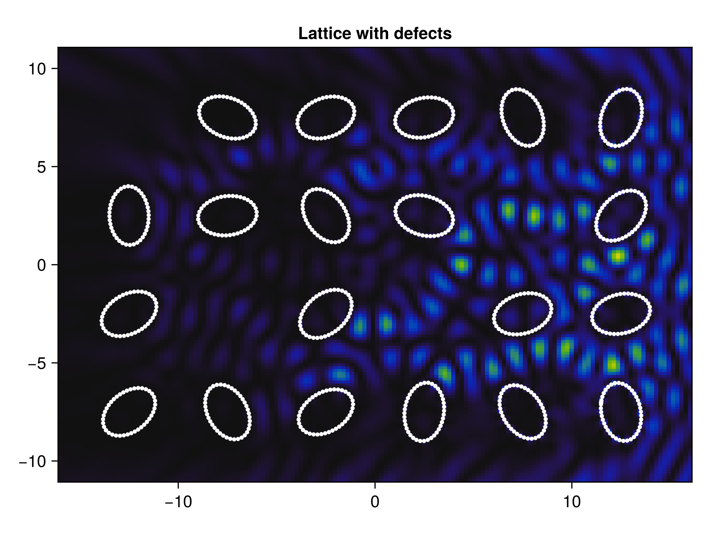

Essentially, a Boundary Integral Method (BIM) reduces the degrees of freedom of 
a problem to those of the boundary. It also means that the problem becomes 
*meshless*, which means that there is no need for simple domains.

However, the method relies on a more abstract notion of integral operators 
(rather than differential equations). Furthermore, most of the matrices are 
dense, which  While numerical integration can be more stable than numerical 
differentiation, one may need to project the continuous integral onto a 
finite-dimensional space of functions, which can be tricky to account for corners 
(infinite information in Fourier spectrum).

> "...on formulas differentiation is nice and integration is hard, but on computable functions differentiation is hard and integration is nice."
>
> **Jacques Carette**


In the method implemented below, a matrix is associated to the required kernel 
for the integral operator. The chosen kernel will dictate how well-behaved (or 
well-conditioned) the matrix will be, and thus which algorithms can be used to 
solve a system \\(A\bm{x}=\bm{b}\\).

A *BIM* is an example of a [Galerkin method](https://en.wikipedia.org/wiki/Galerkin_method).

<!-- ## Demonstration -->
<!-- As an example, I play with a boundary in the shape of the *Aphex Twin* logo, which kind of looks like a \\(\lambda\\). One can see how when considering a permeable barrier, the *BIM* appears to imitate a refractive, optical element. -->

<!-- 
When the potential strength tends to infininty, only eigenstates can go through the billiard. This is due to the *transparency* effect whenever one has a plane-wave with energy \\(E_n\propto k_n^2\\) (the eigenenergy of the billiard).
 -->

# Application to optical problems

## Beam shaping

Continuous (real-angle) beam shaping seems less difficult once one realizes that, 
as long as the incident wave \\(\\phi\\) is a solution of the Helmholtz equation, 
then any linear combination is admissible for the algorithm. For example, an integral 
of the form

\\[\Psi_z(\mathbf{r})=\frac{1}{2\pi}\int\mathrm{d}\mathbf{k} \\; A(\mathbf{k})\\,\Phi(\mathbf{k},\mathbf{r})\\]

effectively molds plane waves into another beam, determined by its spectrum \\(A(\\mathbf{k})\\). A simple beam to test is a *Gaussian beam*, since its spectrum is also a Gaussian.

Using a negative permeable potential, i.e. 
\\(V(\\mathbf{r})=-\\gamma\\delta(\\mathbf{r}-\\mathbf{r}\')\\), 
one can model optical elements such as mirrors and reflective potentials.

## Applications to condensed matter

One can also simulate metamaterials composed of individual rods. For example, by 
creating a lattice with ellipse-like boundaries, it can imitate a meta-optical 
surface, where by adjusting angles and certain parameters, one can have a non-linear 
response for different frequencies (i.e. multiplexing).

## Banded matrices

Briefly, one performs a quadrature for curve elements within the range \\(|i-j|<\\varepsilon<N \\).
Setting \\(|i-j|=N-1\\) yields a fully integrated method, while using \\(|i-j|=0\\) results in a 
fully discretized version. We have found that, for TM polarization, even setting as low as $|i-j|=1$ 
takes similar time and allocations as with \\(|i-j|=0\\), but with increased acccuracy.

## Electromagnetic problem

The EM problem is considerably more difficult to implement than it is to state.
Although one only has two extra fields, \\(E_x\\) and \\(E_y\\), the system is now 
coupled, which means that the original \\(N\times N\\) matrix becmes a dense system 
of size \\(3N\times 3N\\). Furthermore, the system becomes considerably harder for
the LAPACK library to solve the linear problem. Here, band integrated matrices become 
a must in order to prevent singularities showing up from the *Green's tensor*, 
which is implemented using a \\(M\\)-dyadic generalization of the \\(\mathbb{M}\\)
matrix described in [Da Luz, et al. (1997)](https://journals.aps.org/pre/abstract/10.1103/PhysRevE.56.2496),

\\[\\mathbf{M}_{ij}=\\int\_{\\mathcal{C}_j}\\mathrm{d}{s\'}\\;\\mathbf{G}^B(\\mathbf{r}_i,\\mathbf{r}(s')).\\]

Using a compact notation, one obtains the \\(T\\)-dyadic which solves the numerical
scattering problem,

\\[\\mathbf{T}\\equiv\\gamma\\left[\\mathbf{1}\\hat{x}\_\\ell\\hat{x}\_\\ell-\\gamma M^{\\ell m}\\hat{x}\_\\ell\\hat{x}_m\\right]^{-1},\\]

where \\(\\hat{x}\_\\ell\\hat{x}\_m\\) represents a dyad.

# Further steps

The growth of the operator compared to the boundary resolution implies the need 
for either heriarchical matrices or preconditioning using wavelets. As far as my
work goes, I think I might take a rest from this algorithm for a while.