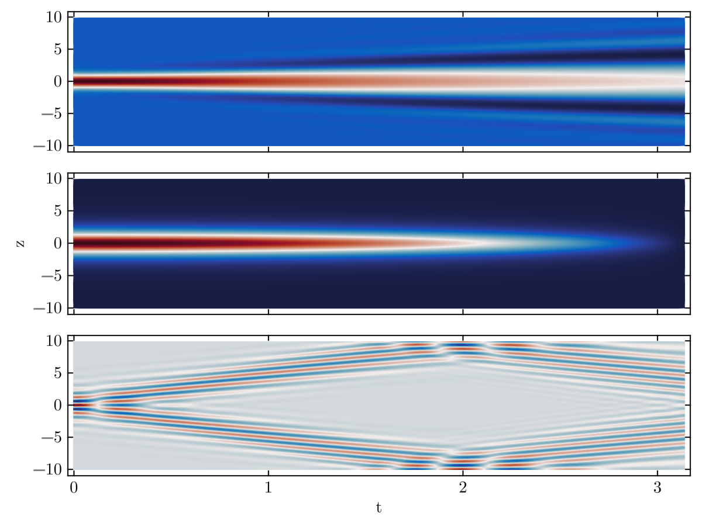

Fiber optics technology has revolutionized communication by enabling the efficient transmission of data over long distances. At the heart of this technology lies the Nonlinear Schrödinger Equation (NLSE), a mathematical model that describes the behavior of optical pulses in fiber optic communication systems. In this blog post, we numerically solve the NLSE using the Split-Step Fourier Method.

## The Nonlinear Schrödinger Equation (NLSE)

The NLSE is a partial differential equation that governs the evolution of optical pulses in a nonlinear medium, such as an optical fiber. It takes the dimensionless form of:


$$
i\frac{\partial \psi}{\partial \xi} + \frac{1}{2}\frac{\partial^2 \psi}{\partial \tau^2} + |\psi|^2\psi = 0
$$

Here, \\(\psi\\) represents the complex electric field envelope of the optical pulse, \\(\xi\\) is the spatial coordinate, \\(\tau\\) is time. The 

## Pseudo Spectral Methods

Pseudo Spectral Methods are numerical techniques employed to solve partial differential equations, including the NLSE. One popular method is the Split-Step Fourier Method, which discretizes both the spatial and temporal domains. The NLSE is then solved in alternating spatial and temporal steps, making it computationally efficient.

### Split-Step Fourier Method

To those that know optics, using Fourier transforms for propagating in time The Split-Step Fourier Method involves breaking down the NLSE into two simpler equations, making it easier to handle numerically. The spatial and temporal evolution are separated using the following steps:

1. **Spatial Step:**
$$
\tilde{\psi}(k, \xi + \Delta \xi) = \text{fft}\left(\exp\left(\frac{i\beta_2 k^2 \Delta \xi}{2}\right) \cdot \text{ifft}\left(A(\xi)\cdot\exp\left(i\gamma |\psi(\xi)|^2 \Delta \xi\right)\right)\right)
$$

2. **Temporal Step:**
$$
\psi(\xi + \Delta \xi, \tau + \Delta \tau) = \exp\left(\frac{i\beta_2 \Delta \tau}{2}\frac{\partial^2}{\partial \tau^2}\right) \cdot \tilde{\psi}(k, \xi + \Delta \xi)
$$

This process is repeated iteratively to simulate the pulse propagation through the fiber. One can write a not-so-compact expression for simulating the evolution numerically.

```julia
FFT(wave::Float) = ifft(exp(-im*dk^2*dt/2) * 
                   fft( exp( im*dt*abs.(wave)^2)*wave))
```



## Conclusion

Understanding and solving the Nonlinear Schrödinger Equation is crucial for optimizing and designing fiber optic communication systems. Pseudo Spectral Methods, like the Split-Step Fourier Method, provide powerful tools for numerically solving these equations, offering insights into the dynamics of optical pulses in nonlinear media. As technology continues to advance, these methods play a vital role in enhancing the efficiency and reliability of fiber optic communication networks.

The Metropolis-Hastings algorithm for simulating the Lenz-Ising model is an excellent example of a Markov chain, since the former is actually a version of a Markov chain Monte Carlo (MCMC) simulation. I present examples based on cartesian and isometric grids.

